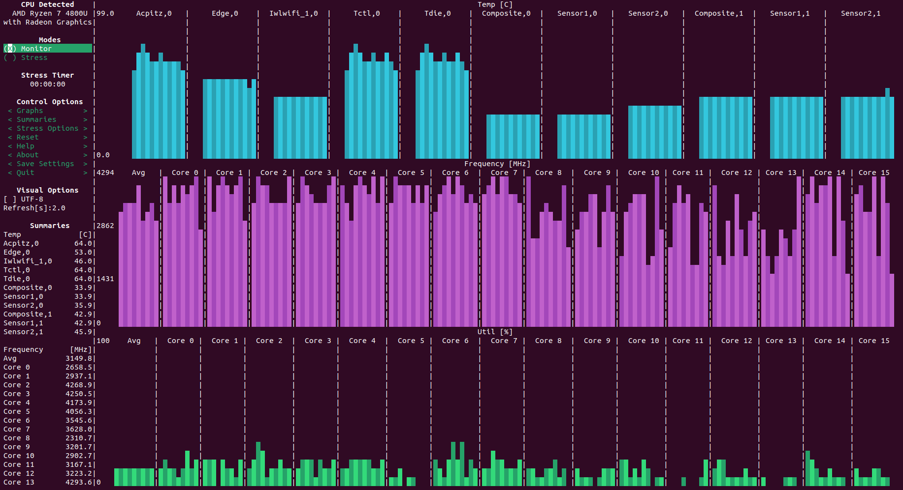
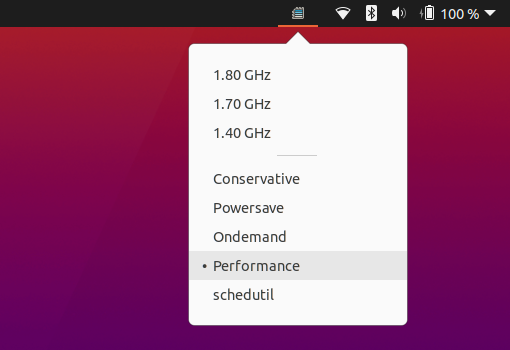

# Imporve your Ubuntu performance

When you install the Ubuntu system on a physical machine, don't forget to do these things to improve your computer's
performance.  
My experiments found that the improvement was very noticeable, based on Ubuntu 20.10.

## use s-tui to monitor and test your max CPU frequency



### how to install

```bash
sudo apt install python3-pip stress
sudo pip3 install s-tui
```

### how to use

```bash
sudo s-tui
```

You can use the arrow keys and space bar to switch between Monitor mode and Stress mode. The Stress mode performs a
stress test on the CPU.

## use indicator-cpufreq to set your CPU frequency



### how to install

```bash
sudo apt install indicator-cpufreq
sudo reboot
```

### how to use

Look at the status bar icon in the upper right corner and click on the emerging icon to set the CPU's performance mode.