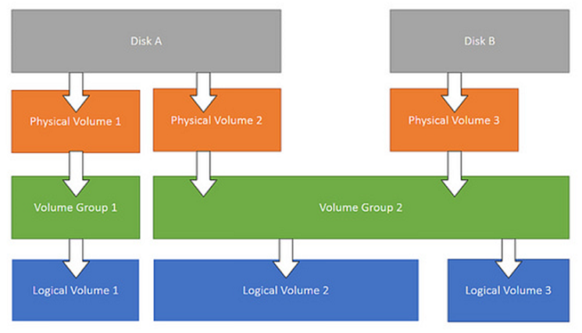

# Online expansion of Ubuntu LVM disk

## LVM overview



### Physical Volume (PV)

Refers to a disk partition, or a device (such as RAID) that has the same function as a disk partition. It is the basic
storage logical block of LVM, but compared with basic physical storage media (such as partitions, disks, etc.), it
contains LVM-related Management parameters.

### Volume Group (VG)

Similar to a physical disk in a non-LVM system, it is composed of one or more physical volumes PV. One or more LVs (
logical volumes) can be created on the volume group.

### Logical Volume (LV)

Similar to disk partitions in non-LVM systems, logical volumes are built on the volume group VG. A file system (such as
/home or /usr, etc.) can be established on the logical volume LV.

## LVM expansion operation

### Create a new primary partition

If you expanded the hard disk size of the virtual machine, and you are still using one hard disk such as `/dev/sda`, you
can do this:

```bash
sudo fdisk /dev/sda
```

Enter `m` to view the help, enter `n` to create a new partition, select the primary partition, step by step, press `w`
to write and save, and get `/dev/sda2`.

You can also add a new hard drive to the machine, and the new hard drive may be shown as `/dev/sdb`. The operation of
creating a new partition is similar.

### Format the partition as ext4 format

```bash
sudo mkfs -t ext4 /dev/sda2
```

`/dev/sda2` represents the new partition, you can replace it with other paths according to your situation, for
example `/dev/sdb1`.

### Find the VG Name

```bash
~# vgdisplay
  --- Volume group ---
  VG Name               ubuntu--vg-root
  System ID
  Format                lvm2
  ......
````

### Add the new partition to the original VG of lvm

```bash
vgextend ubuntu--vg-root /dev/sda2
```

### Check the VG

You should find that there are some free space in the volume group.

```bash
~# vgdisplay
  --- Volume group ---
  VG Name               ubuntu--vg-root
  System ID
  Format                lvm2
  Metadata Areas        2
  Metadata Sequence No  5
  VG Access             read/write
  VG Status             resizable
  MAX LV                0
  Cur LV                3
  Open LV               3
  Max PV                0
  Cur PV                2
  Act PV                2
  VG Size               758.99 GiB
  PE Size               4.00 MiB
  Total PE              194302
  Alloc PE / Size       15103 / <59.00 GiB
  Free  PE / Size       179199 / <700.00 GiB
````

### Check the LV

```bash
~# lvdisplay
  --- Logical volume ---
  LV Path                /dev/ubuntu--vg-root/lv-root
  LV Name                lv-root
  VG Name                ubuntu--vg-root
  LV UUID                KiPSR5-XXvZ-JaXz-fyTw-EE0U-NV7E-6ohpCN
  LV Write Access        read/write
  LV Creation host, time ubuntu-server, 2018-11-15 06:06:41 +0000
  LV Status              available
  # open                 1
  LV Size                45.00 GiB
  Current LE             11520
  Segments               1
  Allocation             inherit
  Read ahead sectors     auto
  - currently set to     256
  Block device           253:0
```

### Extend the LV

```bash
~# lvextend -L 700G /dev/ubuntu--vg-root/lv-root
  Size of logical volume ubuntu--vg-root/lv-root changed from 45.00 GiB (11520 extents) to 700.00 GiB (179200 extents).
  Logical volume ubuntu--vg-root/lv-root successfully resized.
```

### Find the root file system name

```bash
~# df -h
Filesystem                       Size  Used Avail Use% Mounted on
udev                              16G     0   16G   0% /dev
tmpfs                            3.2G   19M  3.2G   1% /run
/dev/mapper/ubuntu--vg-root       45G  5.3G   37G  13% /
```

### Resize file system

```bash

~# resize2fs -p /dev/mapper/ubuntu--vg-root
resize2fs 1.44.1 (24-Mar-2018)
Filesystem at /dev/mapper/ubuntu--vg-root is mounted on /; on-line resizing required
old_desc_blocks = 6, new_desc_blocks = 88
The filesystem on /dev/mapper/ubuntu--vg-root is now 183500800 (4k) blocks long.
```

### View the latest hard drive size

```bash
~# df -h
Filesystem                       Size  Used Avail Use% Mounted on
udev                              16G     0   16G   0% /dev
tmpfs                            3.2G   59M  3.1G   2% /run
/dev/mapper/ubuntu--vg-root      689G  5.4G  655G   1% /
```